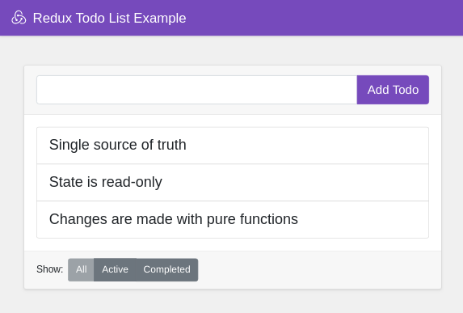

## Example: Todo List

A simple todo app using React, Redux and Booststrap. [see more](https://redux.js.org/basics/example).

### `npm start`

Runs the app in the development mode. 
Open [http://localhost:3000](http://localhost:3000) to view it in the browser.

The page will reload if you make edits. 
You will also see any lint errors in the console.

